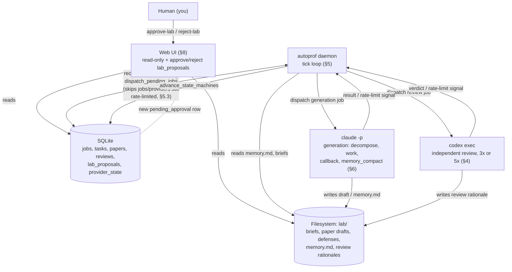
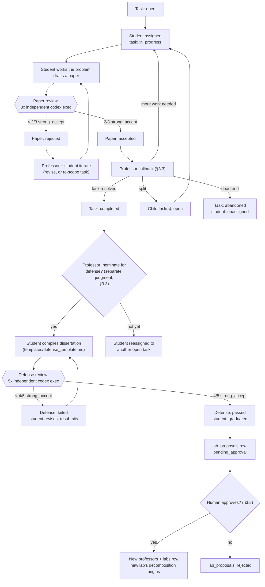

# auto-prof — Architecture

An autonomous research lab: a Professor agent takes a hard problem, breaks
it into tasks, and assigns them to PhD Student agents who try to prove or
disprove their piece and publish novel work. Independent Codex-CLI review
gates decide what counts as real. Students who accumulate enough accepted
work defend a dissertation; passing promotes them to Assistant Professor,
who (with human approval) starts a new lab on a new problem.

This document is the architecture for that system. It is a design only —
no orchestrator code exists yet. A future session implements against this.

## Architecture Diagrams

**System components and data flow.** SQLite (jobs/state) and the `lab/`
filesystem (prose + memory) are the only sources of truth; the daemon,
the two CLIs, and the web UI all read/write through them rather than
holding state themselves — which is what makes the daemon killable and
restartable at any point (§5). The UI is read-only over all *research*
state; its only write path is the human approval gate (§3.5, §8) — it
never writes tasks/papers/reviews/jobs directly.



**End-to-end lifecycle**, from a task being opened through to a graduated
student's new lab going live (§3, §3.5, §4):



## 1. Roles

**Professor**
- Owns a Lab, centered on one root problem statement.
- Decomposes the root problem into a tree of Tasks.
- Assigns each open Task to a Student.
- Receives a callback whenever a Task's state changes meaningfully (a
  paper is accepted/rejected, or a Student reports being stuck) and
  decides what happens next: close the task, keep iterating, split into
  child tasks, or abandon.
- Nominates Students for their PhD defense once their task's body of
  accepted work looks complete.
- Never reviews novelty itself — that's always delegated to independent
  Codex reviewers, so the Professor can't rubber-stamp its own lab's work.

**PhD Student**
- Assigned to exactly one Task at a time.
- Works the problem in the direction the Task specifies (prove, disprove,
  or open-ended exploration), producing one or more candidate results.
- Drafts each candidate result as an arXiv-style paper and submits it to
  review.
- On acceptance, keeps working the task (a task can yield any number of
  papers) until the Professor decides the task is resolved.
- Once nominated, compiles a 50-page dissertation synthesizing their
  accepted papers and defends it.
- On passing defense: becomes an Assistant Professor. On failing: returns
  to `working` with reviewer feedback and revises.

## 2. Entities & SQLite Schema

See `docs/schema.sql` for runnable DDL. Summary:

| table | purpose |
|---|---|
| `labs` | one row per root problem being worked |
| `professors` | one row per Professor agent, including promoted ones |
| `tasks` | the decomposition tree under a lab |
| `students` | one row per Student agent; at most one active task, or `unassigned` |
| `papers` | novel-work submissions tied to a task |
| `defenses` | dissertation submissions tied to a student (at most one active per student, enforced by index) |
| `reviews` | individual Codex reviewer verdicts, for papers or defenses, per review round |
| `lab_proposals` | pending human-approval requests to spawn a new lab (§3.5) |
| `jobs` | the resumable, lease-protected work queue — see §5.1/§5.2 |
| `events` | append-only audit log every job writes to — see §6.1 |
| `provider_state` | account-level rate-limit/usage-window state per provider — see §5.3 |

**Design principle:** SQLite holds state, relationships, and status
transitions. The filesystem holds prose (task briefs, paper drafts, review
rationales, dissertations) as Markdown under `lab/`. Every DB row that
represents a document stores a `path` pointing at its file. This keeps the
research artifacts themselves human-readable and git-diffable, while the
DB stays small and queryable.

```
lab/<lab_id>/
  tasks/<task_id>/
    brief.md
    papers/<paper_id>/
      draft.md              -- overwritten each review_round
      reviews/<round>/{1,2,3}.md
  students/<student_id>/
    defense.md               -- overwritten each review_round
    defense_reviews/<round>/{1..5}.md
```

## 3. State Machines

### 3.1 Task lifecycle

```
open
  -> in_progress        (student assigned, begins working)
  -> pending_prof_review (student submitted a paper outcome, or is stuck)
  -> completed            (professor: task's question is resolved)
  -> abandoned             (professor: task turned out ill-posed / dead end)
  -> in_progress            (professor: re-scope, student keeps going)
     (may also spawn child tasks under the same lab, each starting `open`)
```

`completed` and `abandoned` are both terminal for the task, but **not**
for the student assigned to it — a student's `status`/`task_id` always
transitions in the same callback that closes the task (see §3.3), so a
student is never left pointing at a closed task:
- On `abandoned`: student → `unassigned` (`students.task_id` → `NULL`,
  which the schema's `trg_students_task_assign_insert`/`_update` triggers reflect back
  onto `tasks.assigned_student_id` automatically), then becomes eligible
  for (re)assignment to another open task in the same lab.
- On `completed`: handled by the nomination decision in §3.3 — either the
  student is nominated (→ `defending`) or reassigned to another open task
  (→ `working` on the new `task_id`), never left dangling on the closed
  task.

### 3.2 Student work loop

1. Student works the task's problem.
2. On reaching a candidate result, drafts a paper from
   `templates/paper_template.md`.
3. Paper enters review (see §4): needs **2 of 3 strong_accept** from
   independent Codex CLI reviewers to pass.
4. Rejected → `papers.review_round` increments and a fresh set of 3
   reviewer rows is created for the new round (the schema's
   `UNIQUE(target_type, target_id, review_round, reviewer_index)`
   constraint is what makes a resubmission possible instead of colliding
   with the prior round's reviews). Professor + Student iterate: revise
   the paper, try a different angle, or the Professor re-scopes the task.
   Back to step 1/2.
5. Accepted → paper marked `accepted`, task's Professor callback fires.

### 3.3 Professor callback

Fires whenever: a paper is accepted, a paper is rejected, or a student
reports being stuck (no progress after a configurable number of attempts).
The Professor evaluates the task's full accumulated state (all papers,
their verdicts, task end_criteria) and picks one:

- **Task resolved** → mark `completed`. This is a judgment about the
  *task's question*, not about the student — it does not by itself start
  a defense.
- **Keep going** → task stays `in_progress`, optionally refine
  `end_criteria`.
- **Split** → create one or more child tasks under the same lab; original
  task can close or stay open depending on whether it still has an
  independent question left.
- **Abandon** → mark `abandoned` with a rationale recorded in the task
  brief (e.g. the question was shown to be ill-posed, or subsumed by a
  child task's result); the assigned student is released (§3.1).

**Nomination is a separate decision**, made whenever a task the professor
just closed (`completed`) belongs to a student whose *cumulative* accepted
work across all their tasks looks sufficient for a dissertation — a
student who closes one task out of several they've worked is not
automatically nominated. If not nominated, the student is reassigned to
another open task in the lab (or left `unassigned` if none exists yet).

### 3.4 Defense

Once nominated, the Student compiles `templates/defense_template.md` into
a ~50-page dissertation synthesizing their accepted papers plus original
framing/contributions. Goes through **5 independent Codex CLI reviews**;
needs **4 of 5 strong_accept** to pass.

- **Pass** → student status → `graduated`. A `lab_proposals` row is
  created: a new Professor identity + a problem statement for their field,
  authored by the (soon-to-be-former) supervising Professor. Status
  `pending_approval`.
- **Fail** → `defenses.review_round` increments (a fresh reviewer round,
  same mechanism as paper resubmission in §3.2), student returns to
  `working` with the 5 reviewers' rationales attached as feedback; may
  revise and re-submit.
  *(Open question, not yet decided: whether to cap revision attempts —
  flagged in §7.)*

### 3.5 Promotion & growth gate

`lab_proposals.pending_approval` rows are surfaced by `autoprof status`
and actioned by `autoprof approve-lab <id>` / `autoprof reject-lab <id>`.
**No new lab is created, and no budget is spent on it, until a human
approves it.** This is the sole growth-control mechanism for the
recursive professor-spawns-professor structure, and it's a hard gate, not
a default that can be silently disabled.

**Approval is one atomic transaction, never a bare status update.** A
`lab_proposals` row flipping to `approved` with `resulting_professor_id`/
`resulting_lab_id` still NULL would be an invalid intermediate state — so
`approve-lab <id>` must, inside a single SQLite transaction:
1. create the new `professors` row (`parent_student_id` set for lineage),
2. create the new `labs` row with the proposed root problem, owned by
   that professor,
3. update the `lab_proposals` row to `status='approved'`,
   `resulting_professor_id`, `resulting_lab_id`, `decided_at` all in the
   same statement group.

`lab_proposals.student_id` is `UNIQUE`, so a given graduation can only
ever produce one proposal — a double-submitted or concurrent
`approve-lab` call is rejected by that constraint rather than silently
creating two labs from one graduating student. Once committed, the new
lab's Professor begins its own task decomposition — using exactly the
same machinery as any other lab.

## 4. Review Pipeline

- Every review gate (paper: 3 reviewers / 2-of-3 threshold; defense: 5
  reviewers / 4-of-5 threshold) dispatches N independent `codex exec`
  subprocess calls.
- **Isolation is the whole point**: each call is a fresh subprocess, gets
  only the document under review plus `templates/review_rubric.md` as its
  prompt, and has no visibility into whether other reviewers exist, let
  alone their verdicts. This is what makes "2 of 3 strong accept" a signal
  distinct from "one reviewer's opinion, asked three times."
- The rubric forces a machine-parseable verdict line:
  `VERDICT: strong_accept|accept|weak_accept|weak_reject|reject|strong_reject`
  The harness parses this line; the full response is stored verbatim as
  the rationale file.
- **No partial tallying.** A paper/defense stays `in_review` until all N
  reviews *for its current `review_round`* are recorded. If a reviewer
  call crashes or times out, its `jobs` row follows the retry policy in
  §5.1 — the target's status never advances on incomplete data.
- Tally rule is a strict count of `strong_accept` verdicts (other verdicts,
  including plain `accept`, do not count toward the threshold — this
  matches "2/3 give strong acceptance" and "4/5 strong acceptance" as
  stated in the requirements, not a looser weighted score).

## 5. Harness Execution Model

The harness is a single long-running **daemon process** (planned as
Python, stdlib `sqlite3` + `subprocess`, no heavy dependencies).

**Why a job queue, not "recompute what to do next" each tick:** long
sequences of professor/student/reviewer calls are expensive and slow. If
the daemon is killed mid-call, we must not silently lose or duplicate that
work. So every unit of dispatched work — a professor decomposition call, a
student work session, a paper draft, a single Codex review — is inserted
into `jobs` as `pending` *before* it runs, flipped to `running` when
dispatched, and `done`/`failed` when it returns. §5.1 covers retry policy
for genuine failures; §5.2 covers why a naive "reset stale `running` jobs
to `pending`" rule is not by itself enough to prevent duplicate work, and
what closes that gap.

**Tick loop:**
```
loop forever:
    reclaim_expired_leases()             # running -> pending if lease expired (§5.2)
    dispatch_pending_jobs(budget_cap)    # skips anything not yet eligible (§5.1/§5.3)
    advance_state_machines()             # react to jobs that finished
    sleep(next_wake_delay())             # dynamic -- see §5.3, not a fixed interval
```

Because every tick derives entirely from DB state, **killing and
restarting the daemon at any point is safe** — this is the "persist state,
resume from any state" requirement.

**Where generation calls go:**
- Professor decomposition, student work/drafting, professor callback
  evaluation → `claude -p "<prompt>" --output-format json` (headless
  Claude Code, reusing the CLI already set up on this machine — no
  separate Anthropic API key needed).
- Review verdicts → `codex exec` (see §4).

### 5.1 Job Lifecycle & Retry Policy

A job's terminal states are `done` and `failed`; `failed` is not itself
terminal for the *work item* it represents — it's terminal only once
`attempts >= max_attempts` (default 5, per-job overridable for expensive
kinds). Concretely:
- On a genuine execution error (crash, malformed/unparseable output, a
  non-rate-limit CLI error): `attempts` increments, `last_error` is set,
  and if `attempts < max_attempts` the job goes back to `pending` with a
  short exponential backoff via `not_before` (distinct from the
  rate-limit backoff in §5.3 — same column, different `wait_reason`).
- Once `attempts >= max_attempts`, the job goes to `failed` permanently
  and an `events` row is written recording the terminal failure. This
  surfaces in the web UI (§8) as something needing a human look — the
  daemon does not silently give up on a task/paper/defense forever; a
  permanently failed job stalls its target in its current status, which
  `autoprof status`/the UI will show as "stuck," rather than that target
  quietly vanishing from the queue.
- Rate-limit waits (§5.3) are tracked via `rate_limit_count`, a separate
  counter that never increments `attempts` and never counts toward
  `max_attempts` — being rate-limited is not a failure of the job.

### 5.2 Crash Safety: Leases & Idempotent Writes

A naive rule of "if a `running` job is older than some timeout, reset it
to `pending`" is not sufficient on its own: the original process might
not be dead, just slow (a long `claude -p` call, a loaded machine) — if
it finishes and writes its result *after* the daemon has already
reclaimed and redispatched the same job, the target gets double-processed
(e.g. two paper drafts written, two decompositions applied). Two
mechanisms close this gap:

- **Leases.** Claiming a job is one atomic statement:
  `UPDATE jobs SET status='running', lease_id=<random>, lease_expires_at=<now+timeout> WHERE id=? AND status='pending'`.
  The runner only proceeds if that update actually affected a row (i.e.
  it, not some other process, won the claim). When the job finishes, the
  write is `UPDATE jobs SET status='done', ... WHERE id=? AND lease_id=<its own token>`
  — if the lease already expired and was reclaimed by someone else, that
  token won't match, the update affects zero rows, and the stale
  process's result is discarded rather than applied. `reclaim_expired_leases()`
  only resets jobs whose `lease_expires_at` has actually passed, and
  reclaiming doesn't retroactively invalidate a still-in-flight write —
  the lease-id check at write time is what does that.
- **Idempotent artifact writes.** Every file a job produces (a paper
  draft, a review rationale, a `memory.md` update) is written to a temp
  path and atomically renamed into its final, deterministic location
  (`lab/<lab_id>/.../draft.md`, keyed by paper/task id, not by job id or
  timestamp) — so if a job *does* end up re-run legitimately (e.g. it
  genuinely crashed before finishing), the retry overwrites the same
  path with its new output rather than accumulating duplicate files. The
  corresponding DB row is only updated *after* the rename succeeds, so a
  crash between "file written" and "DB updated" leaves the file
  unreferenced (harmless, cleaned up by a future compaction/GC pass) but
  never leaves the DB pointing at a half-written file.

**What this does and doesn't guarantee — stated precisely, not
oversold.** The lease-id check protects the *database* completion write:
a stale process's `UPDATE ... WHERE lease_id=<its token>` genuinely fails
once its lease is reclaimed. It does **not** by itself stop a stale-but-
still-alive process from performing its atomic file rename a moment
*before* that rejected DB write — a reclaimed worker could in principle
still clobber a freshly-reclaimed run's file with its own (stale) output,
even though its DB write is then correctly rejected. Two things narrow
this down to effectively zero rather than claiming it's impossible:
1. **The runner re-checks its own lease immediately before the rename**
   (a cheap `SELECT lease_id FROM jobs WHERE id=?`), and skips the rename
   entirely if it no longer holds it — this shrinks the race window from
   "however long the job ran" to "the gap between that check and the
   rename," which is effectively unwinnable in practice.
2. **Only one daemon process runs against a given `autoprof.db` at a
   time.** §5 already describes this as a single long-running process, not
   a cluster — this should be enforced explicitly (e.g. an OS-level file
   lock or a `BEGIN IMMEDIATE` sentinel-row transaction taken at startup
   and held for the process's lifetime), so the failure mode this
   protects against is only ever "this process's own orphaned subprocess
   outlived its lease," not "two independent daemons racing." That's a
   substantially smaller and more tractable problem than distributed
   coordination, which this design deliberately does not attempt.

### 5.3 Rate Limits & Usage-Window Backoff

Running for years against `claude -p`/`codex exec` means the daemon *will*
hit rate limits and usage-window exhaustion routinely, not as an edge
case. There are two distinct scopes, and they need different handling:

**Per-call rate limiting (job-scoped).** A single invocation gets a
429/"rate limited, retry after N seconds" response. This only blocks the
one job. On this signal:
- The job's `jobs.status` stays `pending` (this is not a failure — see
  §5.1 — so it must not touch `attempts`/`max_attempts` the way a genuine
  error does; a job can wait out rate limits indefinitely without ever
  being pushed toward `failed`).
- `jobs.rate_limit_count` increments, `jobs.wait_reason` is set to
  `'rate_limited'`, and `jobs.not_before` is set to `now + retry_after` if
  the CLI provided a concrete duration, otherwise exponential backoff
  seeded at e.g. 60s, doubling up to a cap (e.g. 1 hour), keyed off
  `rate_limit_count` rather than `attempts`.
- `dispatch_pending_jobs()` simply skips any job where `not_before > now`
  — no special-casing needed elsewhere in the state machine.

**Account/window exhaustion (provider-scoped).** Headless `claude -p` and
`codex exec` are subscription-backed CLIs, not raw API calls — they're
subject to account-level usage windows (e.g. a 5-hour rolling limit, a
weekly cap) that, once hit, block *every* call to that provider, not just
the one in flight. Treating this as a per-job backoff would be wrong: the
daemon would keep burning attempts on unrelated jobs and hitting the same
wall. Instead:
- A `provider_state` table (one row per provider: `claude`, `codex`)
  tracks `blocked_until`. The CLI's own error output states when the
  window resets (e.g. "resets at 14:32 UTC" or "try again in 3h20m") —
  the daemon parses that and sets `blocked_until` accordingly; if no
  explicit reset time is given, it falls back to a conservative default
  (e.g. now + 1 hour) and re-checks.
- Before dispatching *any* job that calls a given provider,
  `dispatch_pending_jobs()` checks that provider's `blocked_until` first.
  If still blocked, every job needing that provider is skipped this tick
  — no wasted calls, no attempt-count churn on jobs that were never
  actually broken.
- Because `claude` (generation) and `codex` (review) are independent
  providers with independent windows, one being exhausted doesn't stop
  the other — e.g. review jobs can keep draining while generation is
  paused, or vice versa.

**Dynamic wake-up (`next_wake_delay()`).** Rather than a fixed
`sleep(interval)`, each tick computes:
```
next_wake_delay = min(
    default_interval,                          # e.g. 5 min, the idle heartbeat
    earliest(jobs.not_before) - now,           # nearest per-job backoff clearing
    earliest(provider_state.blocked_until) - now  # nearest provider window reset
)
```
clamped to a sane floor (e.g. 10s, to avoid a busy loop) and ceiling (the
default interval, so newly-created work — e.g. a human approving a lab
proposal — is never waited on longer than the normal heartbeat). This is
what "sleep for that amount, wake up automatically, and continue" means
concretely: if the only thing blocking progress is a 5-hour usage window,
the daemon sleeps close to that full duration instead of polling every 5
minutes for hours, but it still wakes and resumes exactly where the job
queue left off — no separate resume step, because §5's job-queue design
already makes every tick fully derived from DB state.

### 5.4 SQLite Connection Requirements

`PRAGMA foreign_keys = ON` and the trigger-enforced invariants in
`docs/schema.sql` (child-task/lab consistency, student/task reciprocity,
one-active-defense, valid review targets) only hold if foreign-key
enforcement is actually on — and that pragma is **per-connection**, not a
database-file setting. Both the daemon process and the web UI process
(§8) must issue it immediately after opening their own connection to
`autoprof.db`; there is no way to bake it into the file once and have it
apply everywhere.

**Planned CLI surface** (next session):
- `autoprof init "<problem statement>"` — creates the first lab + professor
  + root task.
- `autoprof daemon [--interval SEC] [--budget N]` — runs the tick loop.
- `autoprof status` — prints the lab/professor/task/student/paper tree
  with current statuses, and lists any `pending_approval` lab proposals.
- `autoprof approve-lab <id>` / `autoprof reject-lab <id>` — the human
  growth gate from §3.5.

## 6. Context Management & Long-Horizon Memory

Every generation call in §5 (`claude -p ...`) is a **stateless subprocess
invocation** — it has no conversation history of its own. That's fine for
a single call, but this system is meant to run for years: a student
working one task will eventually accumulate dozens of paper attempts,
rejections, and reviewer feedback; a professor will accumulate years of
task-tree decisions. If every prompt just concatenated that agent's full
raw history, prompt size (and $ cost) would grow without bound and
eventually exceed the model's context window outright — the system would
get slower and more expensive every month it ran, and eventually stop
working entirely. That has to be designed out up front, not patched in
later.

The fix is the same one Claude Code itself uses for long conversations —
compact older context into a bounded summary and keep only that plus
recent specifics — applied here **per agent identity** (each professor,
each student) rather than per conversation, since an agent's "session" is
its entire multi-year tenure, not one sitting.

### 6.1 Two-tier storage per agent

- **Raw log (append-only, never compacted away):** every job that
  completes writes exactly one row to the `events` table (actor, event
  type, target, and a pointer to whatever it produced), in addition to
  the `jobs`/`papers`/`reviews` rows already designed in §2/§5. `events`
  is what memory compaction (§6.3) actually reads — job rows alone don't
  carry enough of a narrative (who decided what, and why) to compact into
  a coherent summary; `events` does. This is the audit trail — nothing is
  lost, and it's what §8's web UI renders when you want to inspect history
  in full.
- **Working memory (`memory.md`, bounded size):** one file per agent —
  `lab/<lab_id>/professors/<id>/memory.md` and
  `lab/<lab_id>/students/<id>/memory.md` — holding a compacted,
  continuously-updated summary: current strategy, decisions made and
  *why*, dead ends already tried (so the agent doesn't retry them), open
  threads. **This is the only history fed into that agent's future
  prompts.** Target size is bounded (e.g. ~2,000-4,000 words) regardless
  of how long the agent has been running.

### 6.2 Prompt assembly stays flat over time

Every job that invokes an agent assembles its prompt from a fixed set of
bounded pieces, never from the full raw log:

- **Student work session:** role instructions + student's `memory.md` +
  the current task brief/end_criteria + (if resuming from a rejection)
  that specific rejection's reviewer feedback.
- **Professor callback:** role instructions + professor's `memory.md` +
  the one task's current state that triggered this callback (not every
  task in the lab).

Because these inputs don't grow with calendar time, the **cost and
latency of a single job stays roughly constant whether the lab is a week
old or five years old** — which is what makes the per-tick budget cap in
§7 stay meaningful long-term instead of silently degrading as history
piles up.

### 6.3 Compaction as its own job kind

A new `jobs.kind = 'memory_compact'` job is dispatched whenever an agent's
raw log has grown past a threshold since its last compaction (e.g. every
K new papers/reviews, or every M raw log entries — a simple counter,
checked each tick like everything else in §5). That job:

1. Reads the current `memory.md` plus this agent's `events` rows added
   since `memory_compacted_at`.
2. Asks the model to produce a new `memory.md` that preserves
   decisions/rationale/dead-ends/open threads and drops resolved noise,
   staying within the target size.
3. Overwrites `memory.md` and sets `professors.memory_compacted_at` /
   `students.memory_compacted_at` to the current time in the same write —
   this is what makes step 1's "events added since `memory_compacted_at`"
   well-defined on the *next* compaction rather than re-reading the same
   already-compacted events forever. The superseded `memory.md` version
   isn't deleted — if `lab/` is a git repo (recommended, see below), the
   old version is just a prior commit, giving free version history
   without a new DB table.

This is a normal job like any other in the §5 queue — resumable, retried
on crash, subject to the same budget cap.

### 6.4 Memory inheritance on promotion

When a student graduates and becomes a professor of a new lab (§3.5),
their new `memory.md` isn't a cold start — it's seeded from a compacted
version of their dissertation and the key lessons from their defended
task, so the new professor carries forward priors instead of amnesia.
This stays bounded the same way: it's a compaction of their student
history, not the history itself.

### 6.5 Practical recommendations for a multi-year run

- **Initialize `lab/` as a git repo.** Every `memory.md` write, paper
  draft, and review becomes a commit. This gives free, queryable version
  history for the compacted memories (see 6.3) and the whole research
  corpus, at zero schema cost — `git log`/`git blame` on `memory.md`
  answers "how did this agent's thinking evolve" directly.
- **Record model version per job** (`jobs.model_version` in
  `docs/schema.sql`). Over a multi-year run the underlying Claude/Codex
  versions will change; tying each decision/verdict to the version that
  produced it makes it possible to later ask "did output quality shift
  when the model changed" instead of that being invisible.
- **Compaction threshold should be conservative at first.** Compacting too
  aggressively risks losing a nuance that mattered; compacting too rarely
  reintroduces the unbounded-growth problem this section exists to solve.
  Start with a generous threshold and tighten based on observed prompt
  sizes once the system has real history to compact.

## 7. Growth & Cost Controls

- **New labs require human approval** (§3.5) — the primary safeguard
  against unbounded recursive growth.
- **Per-tick budget cap** bounds total Claude/Codex calls per daemon tick
  regardless of how many labs are active concurrently.
- **Open question (not decided, flagged for a future session):** whether
  to cap the number of defense revise/re-submit cycles a student gets
  before the professor is forced to abandon the task instead. Nothing in
  the current design prevents an indefinite revise loop if a student
  can't clear 4/5 strong_accept.

## 8. Web UI

The system is expected to run with an arbitrary, unbounded number of
professors, students, labs, and tasks running concurrently — nothing in
the schema (§2) caps cardinality anywhere; `labs`, `professors`,
`students`, `tasks`, `papers` are all plain tables with foreign keys, so N
of each is the normal case, not an edge case. A text-only `autoprof
status` dump stops being useful once there are more than a handful of
labs, so a web UI is planned as a first-class read surface (and later,
the approval action) over the same SQLite DB `autoprof status` reads.

- **Read model:** the UI is a thin layer over the existing schema — no
  separate source of truth, no sync step. It queries the same SQLite file
  the daemon writes to.
- **Views:**
  - Lab list — every lab, its root problem, status, and depth in the
    promotion lineage (which professor spawned which, via
    `professors.parent_student_id`).
  - Lab detail — task tree (parent/child), each task's assigned student
    and status.
  - Student detail — their task, paper history with verdicts, defense
    status if applicable.
  - Paper / defense detail — the rendered Markdown content plus each
    reviewer's verdict and rationale side by side.
  - **Pending approvals** — the `lab_proposals.pending_approval` queue,
    since this is the human-in-the-loop growth gate from §3.5/§7; the UI
    is the natural place to action `approve-lab`/`reject-lab` rather than
    only a CLI.
- **Live updates:** since the daemon mutates SQLite on its own schedule
  independent of the UI, the UI should poll or use SQLite's WAL mode with
  a lightweight change-detection poll rather than assuming a push
  mechanism — no separate message bus needed for a single-machine daemon.
- **Write surface stays minimal:** the only mutations the UI should
  perform directly are approve/reject on `lab_proposals`. Everything else
  (task/paper/review state) is daemon-owned; the UI should not offer ways
  to hand-edit research state, to keep the DB's provenance (which agent
  wrote what, which reviewer said what) trustworthy.
- Implementation (framework, hosting) is left open for the next session —
  noted here only so the schema and status semantics are designed to
  support it (e.g. every status enum is UI-legible, every table has the
  foreign keys a tree/detail view needs) rather than needing rework later.

## 9. Explicitly Out of Scope for This Document

- The actual orchestrator implementation (`autoprof` CLI/daemon code).
- The web UI implementation itself (framework choice, hosting) — §8
  describes its shape and read/write contract only.
- Prompt engineering for the professor/student personas.
- Multi-daemon / distributed execution — this design assumes one daemon
  process per machine.
